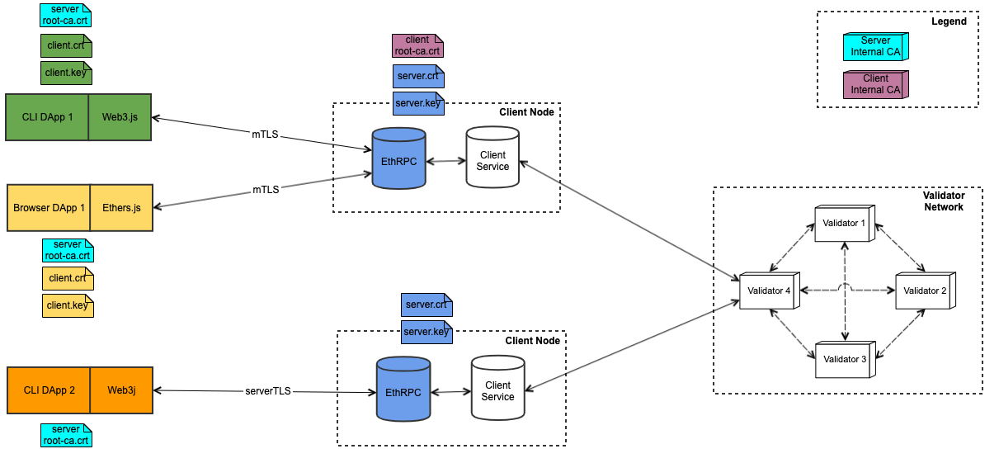
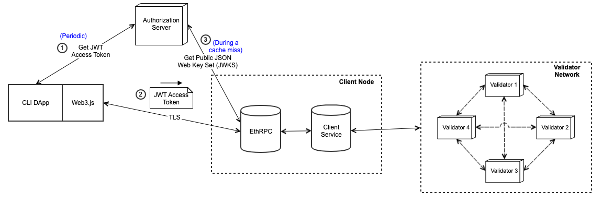
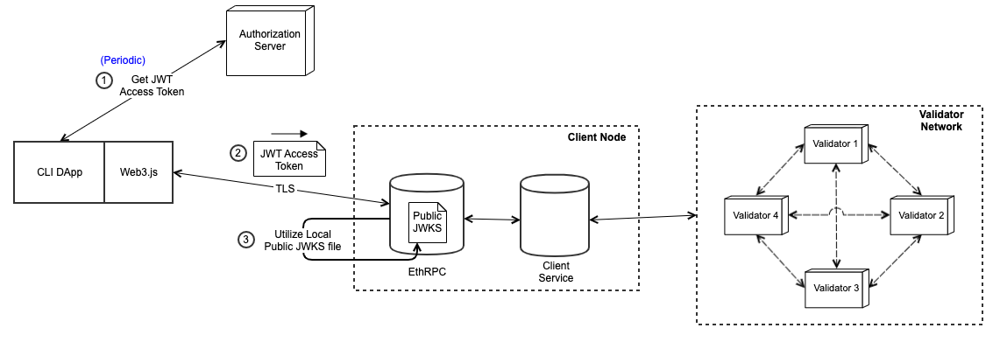

# Ethereum Permissioning

VMware Blockchain for Ethereum in a broad form provides two forms of permissioning, Read and Write Permissioning. Read Permissioning is provided using Certificate Authorities in the form of Mutual TLS by utilizing Client certificates or using OAuth Server by utilizing Client JWT Tokens. The Write Permissioning is provided using a permissioning pre-deployed smart contract.

## Read Permissioning
Read Permissioning is implemented through external Authorizations mechanisms such as Certificate Authority or OAuth Server in two forms namely Mutual TLS and Client JWT.

### High Level Feature Architecture
#### Server and Mutual TLS using Certificate Authority
There will be two options for TLS Modes namely ServerTLS and MutualTLS which can be enabled at EthRPC level

Following diagram depicts both mTLS and serverTLS which have been enabled in two different Client Nodes



**Description of the Depiction**
- Each DApp and EthRPC Server instance have certificates depicted along side. These are the certificates and keys required for the respective components
- Colors represent the association of Certificates and Keys with corresponding DApp or EthRPC instance or internal CA 

**Few Notable Points**
- Server TLS
   - dApp
      - If using an internal CA based Server Certificate, DApp needs to utilize Root Certificate of the EthRPC Server's Server Certificate
   - EthRPC
      - Needs to start up with a Server certificate. If using a internal CA certificate, the root certificate of the internal CA would need to be provided for DApp clients
- Mutual TLS
   - dApp
      - If using an internal CA based Server Certificate, DApp needs to utilize Root Certificate of the EthRPC Server's Server Certificate
      - DApp needs to use Client certificate and Client Key
   - EthRPC
      - Needs to start up with a Server certificate. If using a internal CA certificate, the root certificate of the internal CA would need to be provided for DApp clients
      - If DApp is using an internal CA for Client Certificate, the root certificate of the internal CA which was used to sign the client certificate is needed by EthRPC

#### Client JWT using OAuth Server
DApp would have to handle following aspects,
- Fetching of a JWT Access Token from an OAuth Server managed by Customer
- When utilizing the integration libraries the JWT Access Token has to be passed as a header to EthRPC

Following are the depictions for two of the ways EthRPC can be configured to verify JWT Token,

##### JWT Token Verification using Live Authorization Server


Following is the sequence of steps,

1. The DApp procures JWT Token from the JWT Authorization Server
   - This operation would happen periodically, based on the expiry time set for the JWT Token
2. The DApp through the selected integration library would pass the above acquired JWT Token as a header
3. EthRPC would communicate with the JWT Authorization Server to get the public key for verifying the JWT Token received from DApp. EthRPC would cache the public keys of Authorization server for 5 minutes

##### JWT Token Verification using Local Public Key


Following is the sequence of steps,

1. The DApp procures JWT Token from the JWT Authorization Server
   - This operation would happen periodically, based on the expiry time set for the JWT Token
2. The DApp through the selected integration library would pass the above acquired JWT Token as a header
3. EthRPC would utilize the local public JWKS file for verifying the JWT Token received from DApp

### Enabling Read Permissioning in Blockchain
The Read Permissioning in Blockchain is exposed as mutual TLS and JWT Token based authentication through Certificate Authorities and Authorization servers. The valid combinations which which a client can be brought up are no TLS, mutual TLS, Client JWT with server TLS or Client JWT with mutual TLS.

We have two ways to consume this feature,
1. Utilize the pre-generated helm charts related to various combinations mentioned above [here](../vmbc-deployment/vmbc-sample-deployments)
2. Generate new helm charts for use-cases where you need more customization than the sample helm charts mentioned above

#### Details about relevant fields in Helm charts
Under `clientTlsAndTokenAuthSettings` for each client, following fields could exist depending on the configuration of the helm charts you are using,
- `type`
   - the supported types are `mutualTLS` and `serverTLS`
- `serverCert`
   - this is the server cert which will be used by the client
   - this is a mandatory field if `clientTlsAndTokenAuthSettings` is present
- Todo: Add about more fields

#### Sample Pre-Generated Helm Charts
- VMBC Four Node One Client Deployment with mutualTLS
- VMBC Four Node One Client Deployment with Client JWT and serverTLS
- VMBC Four Node One Client Deployment with Client JWT and mutualTLS

#### Generating new Helm Charts
Todo: Add information about fields in deployment descriptor and link to running of orchestrator tool

### Using Sample DApps for Read Permissioning
As part of this feature, we have provided multiple sample dApps using various integration libraries such as Web3.js, Web3j and Ethers.js as reference and sample implementation to utilize various aspects of read permissioning in VMBC.

#### Web3.js Sample dApp
- Set the content inside [config file](./sample-dapps/authentication/web3js/config.json) as per blockchain and related environment,
- Few of the notable parameters,
   - `tls.mode` supported are `serverTLS` or `mutualTLS`
   - `clientJwt.enabled` should be `true` if VMBC has tokenAuthentication enabled

```sh
# Change to lib for authentication sample dapps
cd vmware-blockchain-samples/vmbc-ethereum/permissioning/sample-dapps/authentication/lib
# Install dependencies
npm install

# Change to web3js authentication sample dapp
cd vmware-blockchain-samples/vmbc-ethereum/permissioning/sample-dapps/authentication/web3js
# Install dependencies
npm install

# Edit the config file as per your enviroment
# Path to config file: vmware-blockchain-samples/vmbc-ethereum/permissioning/sample-dapps/authentication/web3js/config.json

# Run the sample dApp
# If using an internal CA based Auth Server set NODE_EXTRA_CA_CERTS to ca certificate of Auth Server otherwise ignore the variable
NODE_EXTRA_CA_CERTS=../artifacts/certs/auth-server.crt node sample-dapp.js
```

#### Web3j Sample dApp
<Todo: Add details here>

#### Ethers.js Sample dApp
<Todo: Add details here>

## Write Permissioning

For Write Permissioning, VMware Blockchain for Ethereum implements “account permissioning” as a tech preview feature in accordance with the Enterprise Ethereum Alliance (EEA) specifications to provide the necessary tools and granularity to govern actions permitted by accounts on the blockchain. Permissioning in the context of enterprise blockchains is a required feature for our customers as they seek ways to control access to deploy and execute smart contracts running on the blockchain. The account permissioning feature can be enabled during network creation by providing the necessary parameters in the deployment configurations file. The compiled permissioning smart contract and the account(s) that can grant permissions to other addresses should also be included in the genesis file. The “permission admin” user can use a dApp or the permissioning user interface to control which accounts are allowed to send transactions and specify the type of transactions permitted. Types of transaction can be WRITE and DEPLOY permissions to other accounts. The dApp should be the preferred method to grant access to a large number of accounts.

By default in VMware Blockchain the permissioning feature is disabled. It means anybody can read and write to blockchain.

### Permissioning Contract
For reference, Permissioning contract is present at `vmware-blockchain-samples/vmbc-ethereum/permissioning/contracts/Permissioning.sol`

(Note: This contract is provided here just for reference, this contract is pre-deployed in VMware Blockchain for Ethereum, changes to this contract's source code here, will not propogate to VMware Blockchain)
 
### Permissioning fields in `values.yaml`

#### Configurable fields
Users can modify the default values in `values.yaml`. All the fields in `genesisBlock` section will be populated as `genesis.json` for VMware Blockchain blockchain.
 * **alloc**: List of admin accounts who can provide the permissions to other users. These admin accounts by default have read, write and deploy permissions. This field can be modified during blockchain deployment.
 * **permissioningContractBin**: The binary of the permissioning smart contract goes here. User can extend the permissioning smart contract without changing the `checkUserAction` and `constructor` functions.

#### Non-configurable fields
 * **permissioningContractAddress**: The permissioning smart contract is pre-deployed during system boot. Note that this field can't be changed.
 
## Write Permissioning

### How to enable write permissioning?

In `values.yaml`, under "permissioning" section change `ethPermissioningWriteEnabled` value to `true` for write permissioning.
The write permissioning is applicable for both "Contract Deployment" and "Write Transactions" to the Blockchain.

### How to test write permissioning?

Follow the steps listed below, Node.js version 14.20 and up is preferred. 
```sh
# Change to write authorization dApp
cd vmware-blockchain-samples/vmbc-ethereum/permissioning/sample-dapps/write-authorization

# Update the .env file with appropriate VMBC_URL Eg: VMBC_URL="http://x.x.x.x:8545"

# Install dependencies
npm install

# Run the dApp
node testWrite.js
```

## Authorization GUI
- This is a Sample GUI dApp which can assist you in providing permissioning to any Ethereum account
- To provide a permission to an account, you need to use Admin Account of VMware Blockchain
- The details about default Admin account in VMware Blockchain is as follows,
 - Admin Account Address: `0xFB389874FB4e03182A7358275eaf78008775c7ed`
 - Admin Account Private Key: `0x5bedcdfdfe7e3d9444b3494eaee4bb9339be4745d7a4f79cd4bde59d3e9e9dcc`
- To use this Admin Account, import this account into Metamask
- Link to more details about Running and Using Authorization GUI is [here](./sample-dapps/authorization-gui/README.md)

## Troubleshooting Guide
### 1. Permission denied Error
```sh
  code: 'SERVER_ERROR',
  body: '{"error":{"code":-32060,"data":"evm error, status code: -2","message":"Permission denied"},"id":58,"jsonrpc":"2.0"}',
```
#### Solution
You have enabled write permissioning. Make sure the ethereum account you are using to send transactions or deploy contract has the WRITE/DEPLOY permission. 

## References
- JSON RPC API - https://ethereum.org/en/developers/docs/apis/json-rpc/
- JSON RPC Provider Ethers.js - https://docs.ethers.io/v5/api/providers/jsonrpc-provider/
- Web3 Provider Ethers.js - https://docs.ethers.io/v5/api/providers/other/#Web3Provider
